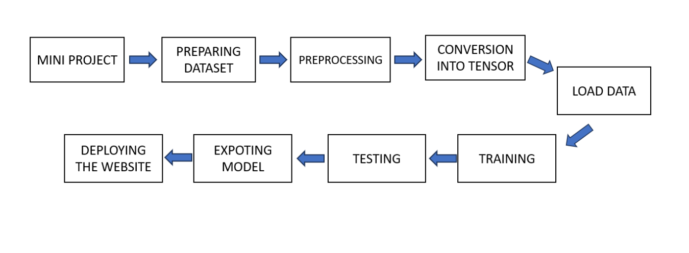

# PLANT-DISEASE-CLASSIFICATION
## INTRODUCTION:
Detection of plant disease has a crucial role in better understanding the economy of India in terms of agricultural productivity.Plant diseases can have significant negative impacts on agricultural productivity and ecosystems such as crop losses,increased pesticide use etc.Here We are building a model, which can classify between healthy and diseased crop leaves and also if the crop have any disease, predict which disease is it.We use ResNet, which have been one of the major breakthrough in computer vision.
ResNet, short for Residual Network is a specific type of neural network that was introduced in 2015 by Kaiming He, Xiangyu Zhang, Shaoqing Ren and Jian Sun in their paper “Deep Residual Learning for Image Recognition”.The ResNet models were extremely successful
The primary objective of this project is to develop a system that can accurately identify and classify diseases affecting plants based on images of their leaves. In cases of high yield loss and with subtle crops, the farmer or user can capture an image of the crop. Using the input image, the system will generate details about the plant disease. This project aims to detect plant diseases at an early stage; timely identification and treatment of plant diseases contribute to higher crop yields. Primarily, it assists terrace farmers and individuals engaged in farming as a hobby.

## PROBLEM STATEMENT:
Terrace farmers and individuals engaged in farming as a hobby frequently encounter challenges related to agricultural knowledge and resource access that may restrict their awareness of plant diseases. The amalgamation of limited formal education, the informal nature of hobby farming, resource constraints, and the absence of professional guidance contributes to a potential lack of awareness among terrace farmers and hobbyist individuals concerning plant diseases.This system helps farmers to gain knowlegde about the plant disease and its types.

## SCOPE OF THE PROJECT:
The primary objective of this project is to empower users to acquire more knowledge about plant diseases. We collect relevant input data from the user, such as a plant image. By processing and training the data, the system generates output corresponding to the specific disease predicted, matching the user-provided input image.

Currently, our project outputs plant disease names. However, we have the potential to enhance the user experience by expanding the output scope. This expansion could include detailed information about the cure for the identified plant diseases. This not only aids in disease identification but also enriches users' overall knowledge about plants, plant diseases, and their respective 

## METHODOLOGY:
The methodology employed in this project involves the utilization of ResNet (Residual Network) architecture, specifically ResNet99.2. In contrast to traditional neural networks, where each layer sequentially feeds into the next layer, ResNet employs residual blocks. In this architecture, each layer not only contributes to the subsequent layer but also has direct connections with layers approximately 2–3 hops away. This design is implemented to mitigate overfitting, a situation characterized by the validation loss ceasing to decrease and subsequently increasing, even as the training loss continues to decrease. Additionally, this approach helps address the vanishing gradient problem, enabling effective training of deep neural networks.
In the context of this project, ResNet plays a crucial role in enhancing accuracy, contributing to the effectiveness of the system.

## WORKING PROCESS


                                  

## PROGRAM
```python
import os                       # for working with files
import numpy as np              # for numerical computationss
import pandas as pd             # for working with dataframes
import torch                    # Pytorch module 
import matplotlib.pyplot as plt # for plotting informations on graph and images using tensors
import torch.nn as nn           # for creating  neural networks
from torch.utils.data import DataLoader # for dataloaders 
from PIL import Image           # for checking images
import torch.nn.functional as F # for functions for calculating loss
import torchvision.transforms as transforms   # for transforming images into tensors 
from torchvision.utils import make_grid       # for data checking
from torchvision.datasets import ImageFolder  # for working with classes and images

%matplotlib inline
```

```python
data_dir = "../input/new-plant-diseases-dataset/New Plant Diseases Dataset(Augmented)/New Plant Diseases Dataset(Augmented)"
train_dir = data_dir + "/train"
valid_dir = data_dir + "/valid"
diseases = os.listdir(train_dir)
nums = {}
for disease in diseases:
    nums[disease] = len(os.listdir(train_dir + '/' + disease))
```

```python
 # converting the nums dictionary to pandas dataframe passing index as plant name and number of images as column
img_per_cl
```
